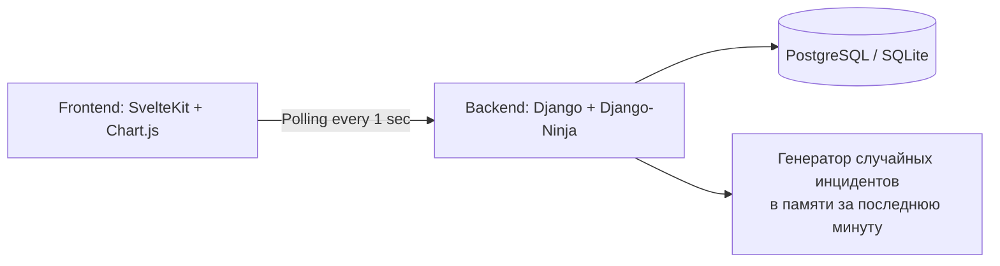

# Security Analytics Dashboard

**Живой дашборд информационной безопасности** с графиками в реальном времени, метриками и аналитикой угроз. Данные обновляются каждую секунду через polling (легко заменяется на SSE/WebSocket).

## 🎯 Возможности

- **Метрики в реальном времени**: High/Medium/Low инциденты за последнюю минуту, общее количество, инциденты в секунду.
- **Динамический график** – линейная диаграмма инцидентов в секунду (история за 60 секунд).
- **Топ типов угроз** – столбчатая диаграмма, обновляемая каждую секунду (DDoS, PortScan, Phishing, Malware, BruteForce).
- **Современный UI**: Tailwind CSS, адаптивная сетка, тёмная тема (готовность), карточки с тенями.
- **Polling data**: фронтенд опрашивает бэкенд каждую секунду (имитация реального времени).

## 🏗 Архитектура



- Бэкенд (Django) отдаёт REST API (/live-stats), имитируя поток событий безопасности (0-5 событий в секунду со случайными типами и критичностью).

- Фронтенд (SvelteKit) каждую секунду опрашивает эндпоинт и реактивно обновляет графики (Chart.js) и карточки.

#### 🛠 Стек технологий

**Бэкенд**	Django, Django-Ninja, PostgreSQL (SQLite для разработки)
**Фронтенд**	SvelteKit, TypeScript, Chart.js, Tailwind CSS
**Деплой**	Render (бэкенд), Vercel (фронтенд)

#### 🚀 Локальный запуск
**Требования**
- Python 3.10+
- Node.js 18+
- Git

1. Клонирование репозитория
```bash
git clone https://github.com/ВАШ_НИК/security-dashboard.git
cd security-dashboard
```
2. Бэкенд (Django)
```bash
cd backend
python -m venv venv
source venv/bin/activate   # Windows: venv\Scripts\activate
pip install -r requirements.txt
python manage.py migrate
python manage.py generate_incidents --count=500   # генерация тестовых данных
python manage.py runserver
```

- Сервер запустится на http://localhost:8000. 
- API документация: http://localhost:8000/api/docs

3. Фронтенд (SvelteKit)
```bash
cd frontend
npm install
npm run dev
```
Откройте http://localhost:5173

4. Проверка работы
- Откройте дашборд в браузере.
- Наблюдайте за изменением цифр и графиков каждую секунду.
- В консоли браузера не должно быть ошибок CORS (настроено через django-cors-headers).

📂 Структура проекта
```text
security-dashboard/
├── backend/                 # Django проект
│   ├── incidents/           # приложение с моделью, API, генератором
│   ├── config/              # настройки Django
│   └── manage.py
├── frontend/                # SvelteKit проект
│   ├── src/
│   │   ├── routes/          # страницы (главная дашборда)
│   │   ├── lib/components/  # LiveStats, LiveLineChart, LiveTopTypesChart
│   │   ├── lib/api/         # API-клиент (необязателен, т.к. прямой fetch)
│   │   └── app.css          # Tailwind
│   ├── package.json
│   └── tailwind.config.js
├── README.md
└── .gitignore
```

🧪 **Демонстрационные данные**
- Бэкенд хранит в памяти список инцидентов за последнюю минуту (скользящее окно).

- При каждом запросе /live-stats генерируется 0–5 новых случайных инцидентов (тип, критичность).

- Старые инциденты (>60 секунд) автоматически удаляются.

- Для сброса данных перезапустите сервер Django.

🔧 Настройка окружения (переменные)
Создайте .env в frontend/:

```text
VITE_API_BASE_URL=http://localhost:8000/api
``` 
Для продакшена измените на реальный URL бэкенда.

🌐 Деплой
**Бэкенд на Render**
1. Зарегистрируйтесь на render.com.

2. Создайте новый Web Service, подключите репозиторий.

3. Укажите команду: cd backend && gunicorn config.wsgi:application

4. Добавьте PostgreSQL (бесплатный план).

5. Переменные окружения: SECRET_KEY, DEBUG=False, ALLOWED_HOSTS=..., CORS_ALLOWED_ORIGINS=https://frontend.vercel.app

**Фронтенд на Vercel**
1. Установите Vercel CLI: npm i -g vercel

2. В папке frontend выполните vercel --prod

3. Укажите переменную окружения VITE_API_BASE_URL=https://your-backend.onrender.com/api

#### 🎓 Что можно улучшить (дорожная карта)
- Заменить polling на SSE (Server-Sent Events) для более эффективного real-time.

- Добавить аутентификацию (JWT + Django REST).

- Сохранять историю инцидентов в PostgreSQL, добавить фильтры по дате и типу.

- Внедрить WebSocket для двусторонней связи (например, для ручного добавления инцидентов).

- Развернуть через Docker Compose (Django + PostgreSQL + Redis + Nginx).

#### 📄 Лицензия
MIT

#### 👤 Автор
[Константин Кононенко] – [https://github.com/kalikrit/security-dashboard]