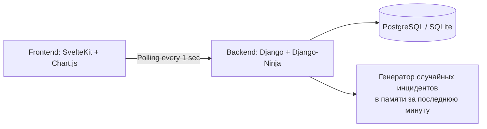

# Security Analytics Dashboard

**Живой дашборд информационной безопасности** с графиками в реальном времени, метриками и аналитикой угроз. Данные обновляются каждую секунду через polling (легко заменяется на SSE/WebSocket).

## 🎯 Возможности

- **Метрики в реальном времени**: High/Medium/Low инциденты за последнюю минуту, общее количество, инциденты в секунду.
- **Динамический график** – линейная диаграмма инцидентов в секунду (история за 60 секунд).
- **Топ типов угроз** – столбчатая диаграмма, обновляемая каждую секунду (DDoS, PortScan, Phishing, Malware, BruteForce).
- **Современный UI**: Tailwind CSS, адаптивная сетка, карточки с тенями.
- **Polling data**: фронтенд опрашивает бэкенд каждую секунду (имитация реального времени).
- **Управление подключением**: при потере бэкенда опрос останавливается, метрики замораживаются (или обнуляются), статус отображает ошибку, автоматические попытки восстановления каждые 5 секунд, ручной Retry с визуальной обратной связью.

## 🏗 Архитектура



- **Бэкенд** (Django) отдаёт REST API (`/live-stats`), имитируя поток событий безопасности (0-5 событий в секунду со случайными типами и критичностью).
- **Фронтенд** (SvelteKit) использует **централизованный стор** (`liveDataStore`), который управляет опросом, ошибками и reconnect. Компоненты (`LiveStatsDisplay`, `LiveLineChartDisplay`, `LiveTopTypesChartDisplay`) являются «чистыми» – они только подписываются на данные из стора и не содержат собственных интервалов. Это обеспечивает предсказуемость и облегчает тестирование.
- **Обработка сбоев**: При ошибке сети интервал опроса останавливается, стор сохраняет последние данные (или обнуляет метрики по желанию). Статус подключения отображается в компоненте `BackendStatus`, который также предоставляет кнопку Retry. Автоматический reconnect таймер пытается восстановить соединение каждые 5 секунд.

## 🛠 Стек технологий

| Компонент | Технологии |
|-----------|------------|
| **Бэкенд** | Django, Django-Ninja, PostgreSQL (SQLite для разработки) |
| **Фронтенд** | SvelteKit, TypeScript, Chart.js, Tailwind CSS |
| **Деплой** | Render (бэкенд), Vercel (фронтенд) |

## 🚀 Локальный запуск

### Требования
- Python 3.10+
- Node.js 18+
- Git

1. **Клонирование репозитория**
   ```bash
   git clone https://github.com/ВАШ_НИК/security-dashboard.git
   cd security-dashboard
   ```

2. **Бэкенд (Django)**
   ```bash
   cd backend
   python -m venv venv
   source venv/bin/activate   # Windows: venv\Scripts\activate
   pip install -r requirements.txt
   python manage.py migrate
   python manage.py generate_incidents --count=500   # генерация тестовых данных
   python manage.py runserver
   ```
   Сервер запустится на `http://localhost:8000`.  
   API документация: `http://localhost:8000/api/docs`

3. **Фронтенд (SvelteKit)**
   ```bash
   cd frontend
   npm install
   npm run dev
   ```
   Откройте `http://localhost:5173`

4. **Проверка работы**
   - Откройте дашборд в браузере.
   - Наблюдайте за изменением цифр и графиков каждую секунду.
   - В консоли браузера не должно быть ошибок CORS (настроено через `django-cors-headers`).

## 📂 Структура проекта

```
security-dashboard/
├── backend/                 # Django проект
│   ├── incidents/           # приложение с моделью, API, генератором
│   ├── config/              # настройки Django
│   └── manage.py
├── frontend/                # SvelteKit проект
│   ├── src/
│   │   ├── routes/          # страницы (главная дашборда)
│   │   ├── lib/
│   │   │   ├── components/  # чистые компоненты (LiveStatsDisplay, LiveLineChartDisplay, LiveTopTypesChartDisplay, BackendStatus)
│   │   │   ├── stores/      # liveDataStore (централизованный стор)
│   │   │   └── api/         # API-клиент
│   │   └── app.css          # Tailwind
│   ├── package.json
│   └── tailwind.config.js
├── README.md
└── .gitignore
```

## 🧪 Демонстрационные данные

- Бэкенд хранит в памяти список инцидентов за последнюю минуту (скользящее окно).
- При каждом запросе `/live-stats` генерируется 0–5 новых случайных инцидентов (тип, критичность).
- Старые инциденты (>60 секунд) автоматически удаляются.
- Для сброса данных перезапустите сервер Django.

## 🔧 Настройка окружения (переменные)

Создайте `.env` в `frontend/`:

```
VITE_API_BASE_URL=http://localhost:8000/api
```

Для продакшена измените на реальный URL бэкенда.

## 🌐 Деплой

### Бэкенд на Render
1. Зарегистрируйтесь на [render.com](https://render.com).
2. Создайте новый Web Service, подключите репозиторий.
3. Укажите команду: `cd backend && gunicorn config.wsgi:application`
4. Добавьте PostgreSQL (бесплатный план).
5. Переменные окружения: `SECRET_KEY`, `DEBUG=False`, `ALLOWED_HOSTS=...`, `CORS_ALLOWED_ORIGINS=https://frontend.vercel.app`

### Фронтенд на Vercel
1. Установите Vercel CLI: `npm i -g vercel`
2. В папке `frontend` выполните `vercel --prod`
3. Укажите переменную окружения `VITE_API_BASE_URL=https://your-backend.onrender.com/api`

## 🧪 Тестирование

В проекте реализованы модульные тесты для ключевых компонентов бэкенда с использованием встроенного `unittest` Django.

### Что покрыто тестами
- **Модель `SecurityIncident`** — создание инцидента, строковое представление.
- **Эндпоинты API**:
  - `/summary` — подсчёт общего количества инцидентов и распределение по критичности.
  - `/timeline` — временной ряд (группировка по дням).
  - `/top-types` — топ типов угроз с лимитом.
  - `/list` — пагинация списка инцидентов.
  - `/live-stats` — структура ответа и работа с глобальным состоянием (имитация скользящего окна).
- **Management command** — `generate_incidents` создаёт заданное количество записей.

### Запуск тестов

```bash
cd backend
python manage.py test incidents
```

Ожидаемый результат: все тесты проходят (10+ успешных проверок). Тесты используют отдельную тестовую БД и не влияют на разработческие данные.

## 📦 Сериализация в Django‑Ninja (объяснение)

В проекте используется Pydantic для автоматической сериализации (превращение объектов Python в JSON) и десериализации (обратное преобразование). Это один из ключевых принципов Django‑Ninja.

### Как это работает
1. Определяется Pydantic-схема (класс, наследующий `Schema`). В ней указываются поля и их типы.
2. В декораторе эндпоинта указывается `response=SomeSchema`.
3. В функции эндпоинта возвращается объект Python (модель Django, QuerySet, словарь, список).
4. Django‑Ninja автоматически:
   - валидирует возвращаемые данные (проверяет типы, обязательность полей);
   - сериализует их в JSON;
   - отдаёт клиенту с правильными заголовками.

### Пример из кода

```python
from ninja import Router, Schema
from typing import Optional
from .models import SecurityIncident

class IncidentListItemSchema(Schema):
    id: int
    timestamp: str
    incident_type: str
    severity: str
    source_country: str
    status: str
    cve_id: Optional[str] = None   # может быть None
    description: Optional[str] = None

@router.get("/list", response=list[IncidentListItemSchema])
def get_incidents(request, page: int = 1, limit: int = 20):
    offset = (page-1)*limit
    incidents = SecurityIncident.objects.all().order_by("-timestamp")[offset:offset+limit]
    # возвращаем список словарей или моделей — Ninja сам преобразует
    return incidents
```

### Зачем разделять схему для ответа и для запроса?
- Ответ обычно содержит больше полей (например, `id`, `timestamp`).
- Запрос может принимать только часть полей (например, `severity`, `status`).
- Это делает API строже и понятнее для потребителей.

### Преимущества подхода
- Минимум кода — не нужно писать ручную сериализацию.
- Типобезопасность — Pydantic проверяет данные на этапе выполнения.
- Автоматическая документация — Swagger / ReDoc генерируется по схемам.
- Лёгкая поддержка — изменение схемы сразу отражается в API и документации.

## 🎓 Что можно улучшить (дорожная карта)

- [x] **Polling с graceful degradation** – интервал останавливается при ошибке, есть автоматическое восстановление.
- [ ] Заменить polling на SSE (Server-Sent Events) для более эффективного real-time.
- [ ] Добавить аутентификацию (JWT + Django REST).
- [ ] Сохранять историю инцидентов в PostgreSQL, добавить фильтры по дате и типу.
- [ ] Внедрить WebSocket для двусторонней связи (например, для ручного добавления инцидентов).
- [ ] Развернуть через Docker Compose (Django + PostgreSQL + Redis + Nginx).

## 📄 Лицензия

MIT

## 👤 Автор

[Константин Кононенко] – [https://github.com/kalikrit/security-dashboard](https://github.com/kalikrit/security-dashboard)